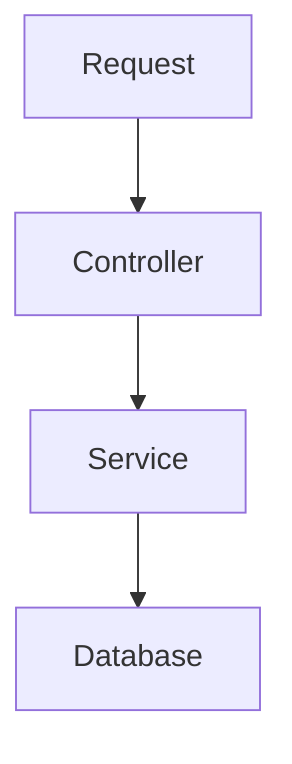
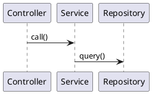

+++
title = "GitHub Copilot Chatmodes"
date = 0
draft = true
tags = ["genai"]
categories = ["GenAI DiveIn"]
summary = "What, How, Why, When and Where of Chatmodes"
+++

<div style="
  background: linear-gradient(135deg, #d4f8d4, #a9e6a9, #7fdc7f);
  padding: 20px;
  border-radius: 12px;
  color: #064b06;
  font-size: 1.05rem;
  box-shadow: 0 2px 8px rgba(0,0,0,0.1);
  margin-bottom: 2rem;
">
  <h2 style="margin-top: 0;">😄 Why Did GitHub Create Chat Modes?</h2>
  <p>
    Legend says GitHub engineers were tired of answering the same question:
    <em>“Why is my YAML not working?”</em> <br><br>
    After years of watching developers summon GPT like a confused genie 
    (“Please fix my CI… no wait… also write tests… also explain compliance…”), 
    GitHub decided:
  </p>
  <blockquote style="border-left: 4px solid #2d7a2d; padding-left: 10px;">
    “Let’s give people modes—so ChatGPT stops playing 4-in-1 roles!”
  </blockquote>
  <p>
    And boom 💥  
    <strong>GitHub Copilot Chat Modes</strong> were born — the structured, focused, 
    no-nonsense versions of your favourite AI buddy.
  </p>
</div>


# 🧩 Topic

Write the main topic in 2–4 sentences.  
Explain what the blog post covers and the problem you're solving.

---

# 💭 Thoughts / Context

Use this section to explain:

- Why this topic matters  
- Real-world use cases  
- Personal insights  
- Challenges you faced  

Example:

> When I started working on XYZ, I realized ABC was confusing.  
> So here’s a clean breakdown…

---

# 🧪 Code Example

Use the fenced block syntax for syntax highlighting.

### Java

```java
public class HelloBrew {
    public static void main(String[] args) {
        System.out.println("Hello Brew Bits!");
    }
}
```

### SQL

```sql
SELECT id, name 
FROM employees
WHERE active = true;
```

### Bash

```bash
curl -X GET "http://localhost:8080/api/hello"
```

---

# 📊 Diagrams

## Mermaid

> Mermaid works because Goldmark unsafe mode is enabled.



---

## PlantUML (PUML)

> Requires local preview or external rendering.



---

# 🖼️ Images

Place images in:

```
static/images/<myimage>.png
```

Use them like this:

```markdown

```

Optional caption:

*Figure: Sample architecture diagram.*

---

# 📝 Notes / Learnings

Use bullet points to summarize:

- What you learned  
- Pitfalls  
- Best practices  
- Edge cases  

---

# ✅ Final Comments

Wrap up the article here:

- Main takeaway  
- When to use this approach  
- Suggestions for the reader  
- Link to related posts  

Finish with a friendly note:

> Thanks for reading!  
> Feel free to suggest improvements or ask questions. ☕💻
