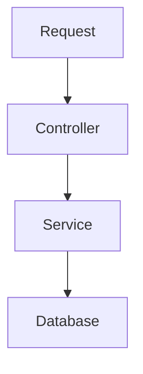

Welcome to **Brew Bits**! ☕💻  
Your weekly shot of *coding + caffeine*.

---

## ☕ Java Code Example

```java
public class HelloBrew {
    public static void main(String[] args) {
        System.out.println("Hello, Brew Bits!");
    }
}
```

---

## 🗄️ SQL Query Example

```sql
SELECT id, name, role
FROM employees
WHERE active = true;
```

---

## 📊 Mermaid Diagram Example

> Works if you enabled Mermaid in **hugo.toml**:  
> `enableInlineShortcodes = true`  
> `markup.goldmark.renderer.unsafe = true`



---

## 🖼️ Image Example

Place the image here:

```
static/images/architecture.png
```

Use it like this:

```markdown

```

---

### Final Notes

- All code blocks use **standard fenced code**, so PaperMod highlights them automatically.
- Mermaid works when Goldmark unsafe rendering is ON.
- No Hugo shortcodes → no shortcode rendering issues.

