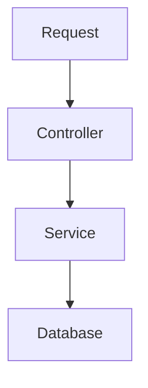
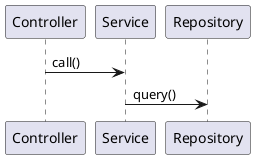

+++
title = ""
date = 0
draft = true
tags = []
categories = []
summary = ""
+++


# 🧩 Topic

Write the main topic in 2–4 sentences.  
Explain what the blog post covers and the problem you're solving.

---

# 💭 Thoughts / Context

Use this section to explain:

- Why this topic matters  
- Real-world use cases  
- Personal insights  
- Challenges you faced  

Example:

> When I started working on XYZ, I realized ABC was confusing.  
> So here’s a clean breakdown…

---

# 🧪 Code Example

Use the fenced block syntax for syntax highlighting.

### Java

```java
public class HelloBrew {
    public static void main(String[] args) {
        System.out.println("Hello Brew Bits!");
    }
}
```

### SQL

```sql
SELECT id, name 
FROM employees
WHERE active = true;
```

### Bash

```bash
curl -X GET "http://localhost:8080/api/hello"
```

---

# 📊 Diagrams

## Mermaid

> Mermaid works because Goldmark unsafe mode is enabled.



---

## PlantUML (PUML)

> Requires local preview or external rendering.



---

# 🖼️ Images

Place images in:

```
static/images/<myimage>.png
```

Use them like this:

```markdown

```

Optional caption:

*Figure: Sample architecture diagram.*

---

# 📝 Notes / Learnings

Use bullet points to summarize:

- What you learned  
- Pitfalls  
- Best practices  
- Edge cases  

---

# ✅ Final Comments

Wrap up the article here:

- Main takeaway  
- When to use this approach  
- Suggestions for the reader  
- Link to related posts  

Finish with a friendly note:

> Thanks for reading!  
> Feel free to suggest improvements or ask questions. ☕💻

